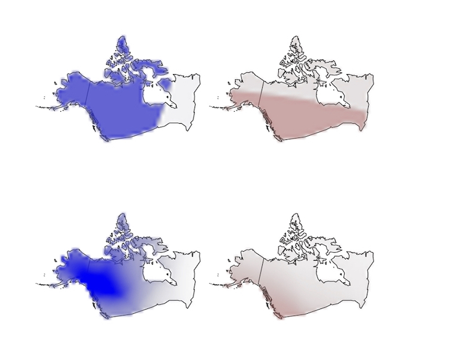
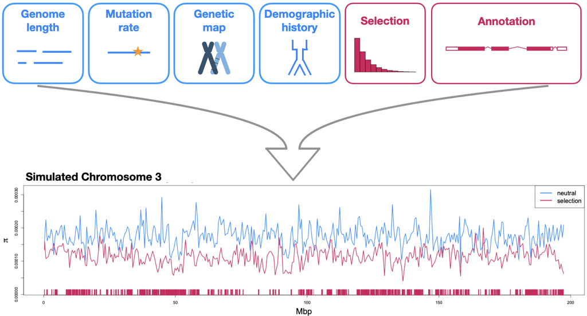
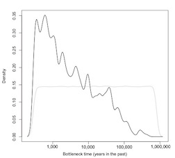
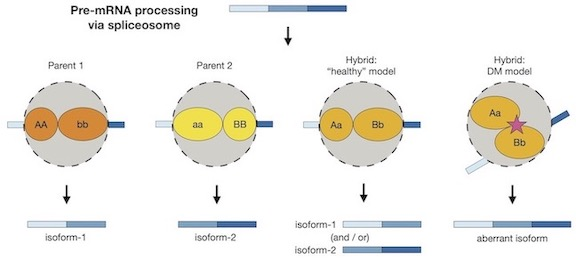

#### Machine learning tools for spatial demographic inference

Genetic variation is shaped in part by a population’s ability to disperse, and by the density of individuals in the habitat.
Obtaining estimates for such parameters is important for studying range shifts in response to climate change, genomic clines across hybrid zones, phylogeography, and the spread of adaptive alleles through space; and is important for more applied research in conservation, managing disease-vector populations, and wildlife biology.
A promising strategy for inferring demographic parameters is using spatial genomic data.
However, current genetics-based methods have constraints that prevent their use in many species, leaving a critical gap in our methods toolbox.

During my postdoc I have developed machine learning approaches for estimating dispersal rate from population genetic data.
These methods can be used with single nucleotide polymorphism datasets, making it possible to infer dispersal rate for species with limited genomic resources.
Currently I am working on a tool for estimating maps of population density and dispersal across a landscape.
This method is useful for identifying barriers to migration, source-sink dynamics, or population-dense areas, and I have applied it to publicly available North American grey wolf data.

###### Relevant publications:
Smith et al. 2023, *Genetics*\
Smith and Kern 2023, *bioRxiv*

###### Software:
[disperseNN](https://github.com/kr-colab/disperseNN)\
[disperseNN2](https://dispersenn2.readthedocs.io/en/latest/)\
mapNN

&nbsp;
&nbsp;
&nbsp;
&nbsp;
&nbsp;

#### Community resources for simulating genetic data

To improve our inferences in population genomics it behooves us to incorporate as much biological detail as possible into our simulations.
To this end, I am working with the PopSim Consortium to develop and maintain a repository of population genetic simulations, [stdpopsim](https://popsim-consortium.github.io/stdpopsim-docs/stable/index.html), that provides literature-backed parameters for producing genomic data for various species in a package that is accessible to all.
An important goal of this ongoing project is to provide a standardized framework for comparing empirical results and validating new inference methods.
Currently I am working on a PopSim Consortium analysis to implement models of genome wide natural selection.

&nbsp;
&nbsp;
&nbsp;
&nbsp;
&nbsp;

#### Inferring the timing of population differentiation

In collaboration with Dr. Rebecca Safran’s lab, I hypothesized and compared different models of population history for a widely-distributed species, barn swallows (*Hirundo rustica*), using whole genome sequencing data.
My analysis indicated subspecies divergence to be an order of magnitude more recent than the previously published estimate that was based on mitochondrial DNA.
I have an ongoing collaboration with the Safran Lab to analyze the geographic population history of the barn swallow subspecies using phylogenetic approaches.

###### Relevant publications:
(Smith et al. 2018, *Molecular Ecology*).

&nbsp;
&nbsp;
&nbsp;
&nbsp;
&nbsp;

#### Alternative splicing in population differentiation

With Dr. Nolan Kane and colleagues I found differentially-spliced mRNA isoforms between wild and domesticated sunflowers (*Helianthus annuus*).
Ours is one of the first studies to explore transcriptome-wide splicing differentiation between closely related, non-human populations.
Next, I discovered incorrectly-spliced transcripts in hybrid sunflowers.
The erroneous transcripts were negatively associated with seedling growth rate, and many were regulated by multiple alleles with nonadditive interactions.
These findings suggest that splicing errors could be the molecular manifestation of small-effect genetic incompatibilities.
To characterize the role of splicing in population divergence more generally, we must study additional diverging populations or species.
In this research area, I am working with the Kane Lab to study divergent splice forms in a dune-adapted population of *H. petiolaris*.

###### Relevant publications:
Smith et al. 2018, *PNAS*\
Smith et al. 2021, *Evolution*

