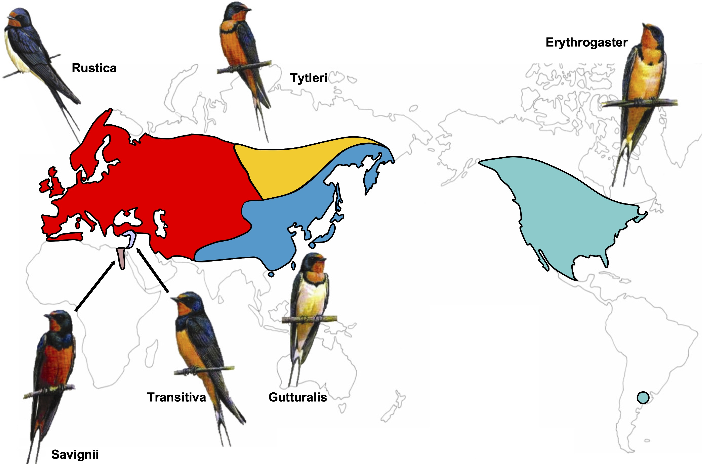

## Current Research

#### Machine learning tools for spatial demographic inference

{: width="750" }

Genetic variation is shaped in part by a population’s ability to disperse, and by the density of individuals in the habitat.
Obtaining estimates for such parameters is important for studying range shifts in response to climate change, genomic clines across hybrid zones, phylogeography, and the spread of adaptive alleles through space.
A promising strategy for inferring demographic parameters is using spatial genomic data.
However, current genetics-based methods have constraints that prevent their use in many species, leaving a critical gap in our methods toolbox.

As an NIH postdoc fellow in the Kern-Ralph co-lab I developed machine learning approaches for estimating dispersal rate from population genetic data.
These methods can be used with single nucleotide polymorphism datasets, making it possible to infer dispersal rate for species with limited genomic resources.
Next, I developed a tool for estimating maps of population density and dispersal across a landscape.
This method is useful for identifying barriers to migration, source-sink dynamics, or population-dense areas, and I applied it to publicly available North American grey wolf data.

###### Software:
[mapNN](https://github.com/kr-colab/mapNN)\
[disperseNN2](https://dispersenn2.readthedocs.io/en/latest/)\
[disperseNN](https://github.com/kr-colab/disperseNN)

###### Relevant publications:
Smith et al. 2023, *Genetics*\
Smith and Kern 2023, *BMC Bioinformatics*\
Smith et al. 2024, *Molecular Ecology Resources*

&nbsp;
&nbsp;
&nbsp;
&nbsp;
&nbsp;

## Other research areas

#### Inferring the timing of population differentiation

{: width="500" }

To conserve biodiversity it is important to understand how populations diverge into new species.
In collaboration with Rebecca Safran’s lab, I analyzed the timescale of divergence between barn swallow subspecies (*Hirundo rustica*) using whole genome sequencing data.
My analysis indicated subspecies divergence to be an order of magnitude more recent than the previously published estimate that was based on mitochondrial DNA.
Related, Sam Flaxman and I showed that haplotype-based summary statistics improve demographic inference using whole genome data with approximate Bayesian computation.

###### Relevant publications:
Smith et al. 2018, *Molecular Ecology*\
Smith and Flaxman, 2020, *Molecular Ecology Resources*

&nbsp;
&nbsp;
&nbsp;
&nbsp;
&nbsp;

#### Alternative splicing during population differentiation

{: width="500" }

With Nolan Kane and colleagues I found differentially-spliced mRNA isoforms between wild and domesticated sunflowers (*Helianthus annuus*).
Ours is one of the first studies to explore transcriptome-wide splicing differentiation between closely related plant populations.
Next, we discovered incorrectly-spliced transcripts in hybrid sunflowers.
The erroneous transcripts were negatively associated with seedling growth rate, and many were regulated by multiple alleles with nonadditive interactions.
These findings suggest that splicing errors could be the molecular manifestation of small-effect genetic incompatibilities.
I am currently writing a review on alternative splicing evolution in plants with Peter Innes and Nolan Kane.

###### Relevant publications:
Smith et al. 2018, *PNAS*\
Smith et al. 2021, *Evolution*

&nbsp;
&nbsp;
&nbsp;
&nbsp;
&nbsp;

#### Host-microbe interactions during population divergence

{: width="250" }

To explain differences in gut microbial communities we must determine how processes regulating microbial community assembly (colonization, persistence) differ among hosts and affect microbiota composition. With the Bolnick Lab, I studied natural populations of threespine stickleback (Gasterosteus aculeatus), a small fish, to identify major pathways of microbial colonization of the gastrointestinal tract. Using high-throughput 16S rRNA sequencing and bioinformatics, we found that sticklebacks from different lakes harbored different gut microbes, and that after controlling for food-associated and environmental microbes the gut microbiota appeared to be under genetic control. 

###### Relevant publications:
Smith et al. 2015, *ISME J*

&nbsp;
&nbsp;
&nbsp;
&nbsp;
&nbsp;

