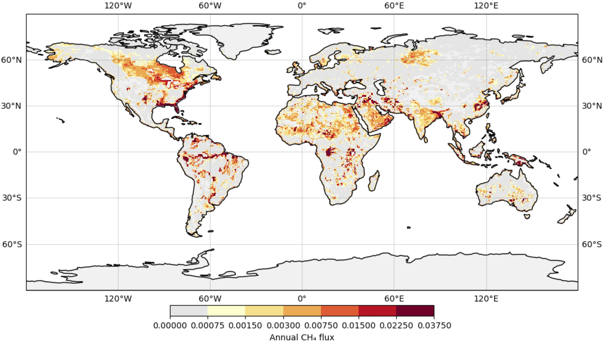

#### Machine learning for estimating wetland mathane emissions

{: width="750" }

Natural methane emissions from wetlands are a major contributor to the atmospheric methane budget and changing climate.
In addition, earth system models have raised concerns about a positive feedback loop involving the release of methane as a result of melting of the arctic permafrost.
Thus, to fully characterize the global methane cycle and ultimately guide mitigation strategies, a crucial goal is to accurately quantify emissions produced by wetlands.

My project is merging (i) a process based model and (ii) machine learning to improve methane estimates.
I applied transfer learning techniques—--pre-training, domain-adaptation, cross-domain model stacking, etc---to augment our limited training set with abundant, simulated outputs from the process based model to improve cross validation accuracy.
I also explored various remotely sensed variables, including building a CNN to extract spatial features from MODIS images, but it was not advantageous to use these data in the final model.
Global upscaling gave a total emissions estimate that was intermediate between current process-based and machine learning-based outputs for wetlands: 143 Tg/yr.

&nbsp;
&nbsp;
&nbsp;
&nbsp;
&nbsp;

#### Machine learning tools for spatial demographic inference

{: width="750" }

Genetic variation is shaped in part by a population’s ability to disperse, and by the density of individuals in the habitat.
Obtaining estimates for such parameters is important for studying range shifts in response to climate change, genomic clines across hybrid zones, phylogeography, and the spread of adaptive alleles through space.
A promising strategy for inferring demographic parameters is using spatial genomic data.
However, current genetics-based methods have constraints that prevent their use in many species, leaving a critical gap in our methods toolbox.

I developed machine learning approaches for estimating dispersal rate from population genetic data.
These methods can be used with single nucleotide polymorphism datasets, making it possible to infer dispersal rate for species with limited genomic resources.
Most recently I developed a tool for estimating maps of population density and dispersal across a landscape.
This method is useful for identifying barriers to migration, source-sink dynamics, or population-dense areas, and I applied it to publicly available North American grey wolf data.

###### Software:
[disperseNN](https://github.com/kr-colab/disperseNN)\
[disperseNN2](https://dispersenn2.readthedocs.io/en/latest/)\
[mapNN](https://github.com/kr-colab/mapNN)

###### Relevant publications:
Smith et al. 2023, *Genetics*\
Smith and Kern 2023, *BMC Bioinformatics*\
Smith et al. 2024, *Molecular Ecology Resources*

&nbsp;
&nbsp;
&nbsp;
&nbsp;
&nbsp;

#### Inferring the timing of population differentiation

{: width="500" }

To conserve biodiversity it is important to understand how populations diverge into new species.
In collaboration with Dr. Rebecca Safran’s lab, I analyzed the timescale of divergence between barn swallow subspecies (*Hirundo rustica*) using whole genome sequencing data.
My analysis indicated subspecies divergence to be an order of magnitude more recent than the previously published estimate that was based on mitochondrial DNA.
In this research area, I have an ongoing collaboration with the Safran Lab where we are analyzing the geographic population history of the barn swallow subspecies using phylogenetic approaches.

###### Relevant publications:
Smith et al. 2018, *Molecular Ecology*\
Smith and Flaxman, 2020, *Molecular Ecology Resources*

&nbsp;
&nbsp;
&nbsp;
&nbsp;
&nbsp;

#### Alternative splicing during population differentiation

{: width="500" }

With Dr. Nolan Kane and colleagues I found differentially-spliced mRNA isoforms between wild and domesticated sunflowers (*Helianthus annuus*).
Ours is one of the first studies to explore transcriptome-wide splicing differentiation between closely related, non-human populations.
Next, I discovered incorrectly-spliced transcripts in hybrid sunflowers.
The erroneous transcripts were negatively associated with seedling growth rate, and many were regulated by multiple alleles with nonadditive interactions.
These findings suggest that splicing errors could be the molecular manifestation of small-effect genetic incompatibilities.
To characterize the role of splicing in population divergence more generally, we must study additional diverging populations or species.
I am currently working with the Kane Lab to study divergent splice forms in a dune-adapted population of *H. petiolaris*.

###### Relevant publications:
Smith et al. 2018, *PNAS*\
Smith et al. 2021, *Evolution*\
Innes et al. 2023, *Heredity*

&nbsp;
&nbsp;
&nbsp;
&nbsp;
&nbsp;

#### Host-microbe interactions

{: width="250" }

To explain differences in gut microbial communities we must determine how processes regulating microbial community assembly (colonization, persistence) differ among hosts and affect microbiota composition. With the Bolnick Lab, I studied natural populations of threespine stickleback (Gasterosteus aculeatus), a small fish, to identify major pathways of microbial colonization of the gastrointestinal tract. Using high-throughput 16S rRNA sequencing and bioinformatics, I found that sticklebacks from different lakes harbored different gut microbes, and that after controlling for food-associated and environmental microbes the gut microbiota appeared to be under genetic control. Next, I collaborated with the Bolnick Lab to examine changes in gut microbiota in response to macro-parasite infection. Our findings in sticklebacks are important for understanding the factors at play during population differentiation and for understanding the factors that may shape the gut microbiota more generally.

###### Relevant publications:
Smith et al. 2015, *ISME J*\
Ling  et al. 2020, *ISME J*

&nbsp;
&nbsp;
&nbsp;
&nbsp;
&nbsp;

