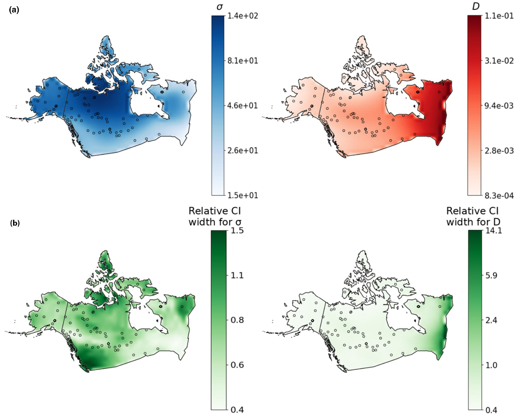

I just started this website. Bear with me as a flesh this section out...

## Machine learning tools for spatial demographic inference

Genetic variation is shaped in part by a population’s ability to disperse, and by the density of individuals in the habitat. Obtaining estimates for such parameters is important for studying range shifts in response to climate change, genomic clines across hybrid zones, phylogeography, and the spread of adaptive alleles through space; and is important for more applied research in conservation, managing disease-vector populations, and wildlife biology. A promising strategy for inferring demographic parameters is using spatial genomic data. However, current genetics-based methods have constraints that prevent their use in many species, leaving a critical gap in our methods toolbox.

During my postdoc I have developed machine learning models for estimating dispersal rate from population genetic data.
These methods can be used with single nucleotide polymorphism datasets, making it possible to infer dispersal rate for species with limited genomic resources.

##### Relevant publications:
Smith et al. 2023, Genetics
Smith and Kern 2023, bioRxiv

