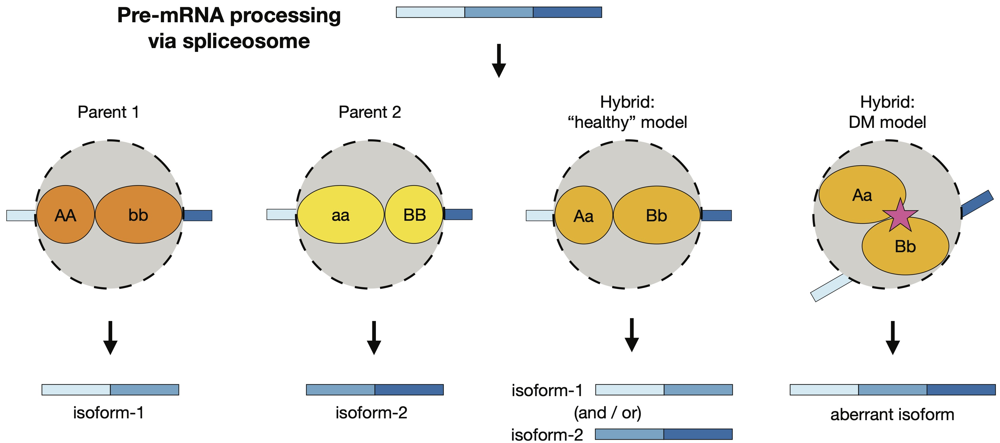

I just started this website. Bear with me as a flesh this section out...

#### Machine learning tools for spatial demographic inference

Genetic variation is shaped in part by a population’s ability to disperse, and by the density of individuals in the habitat. Obtaining estimates for such parameters is important for studying range shifts in response to climate change, genomic clines across hybrid zones, phylogeography, and the spread of adaptive alleles through space; and is important for more applied research in conservation, managing disease-vector populations, and wildlife biology. A promising strategy for inferring demographic parameters is using spatial genomic data. However, current genetics-based methods have constraints that prevent their use in many species, leaving a critical gap in our methods toolbox.

During my postdoc I have developed machine learning models for estimating dispersal rate from population genetic data.
Next, I have developed a machine learning model for estimating maps of population density and dispersal across a landscape.
As before, this tool works with unphased SNP data and relatively small sample sizes. This method is useful for identifying barriers to migration, source-sink dynamics, or population-dense areas, and we have applied it to publicly available North American Grey Wolf data. I am currently writing a manuscript for this project.
These methods can be used with single nucleotide polymorphism datasets, making it possible to infer dispersal rate for species with limited genomic resources.

###### Relevant publications:
Smith et al. 2023, *Genetics*\
Smith and Kern 2023, *bioRxiv*

#### Community resources for simulating genetic data

Last, I am contributing to projects related to simulations and best practices in population genomics. To improve our inferences in population genomics it behooves us to incorporate as much biological detail as possible into our simulations. To this end, I am working with the PopSim Consortium to develop and maintain a repository of population genetic simulations, stdpopsim, that provides literature-backed parameters for producing genomic data for various species in a package that is accessible to all. An important goal of this ongoing project is to provide a standardized framework for comparing empirical results and validating new inference methods. Our most recent publication (Lauterbur et al. 2023, eLife) highlights new species that were added to stdpopsim, including non-model species. Currently I am working with the PopSim consortium to implement models of genome wide natural selection.

#### Inferring the timing of population differentiation

In collaboration with Dr. Rebecca Safran’s lab, I hypothesized and compared different models of population history for a widely-distributed species, barn swallows (Hirundo rustica), using approximate Bayesian computation (ABC) combined with random forests, a type of supervised machine learning. As part of one of the first studies to use whole genome sequencing data with ABC, my analysis indicated subspecies divergence to be an order of magnitude more recent than the previously published estimate. Currently I am collaborating with the Safran Lab to analyze the geographic population history of the barn swallow subspecies using phylogenetic approaches.

###### Relevant publications:
(Smith et al. 2018, Molecular Ecology).

#### Alternative splicing in population differentiation

With Dr. Nolan Kane and colleagues, I found differentially-spliced mRNA isoforms between wild and domesticated sunflowers (*Helianthus annuus*). My study is one of the first to explore transcriptome-wide splicing differentiation between closely related, non-human populations using next-generation sequencing. Most domesticate-associated splice forms were present in the wild population, suggesting they arose from standing variation and gained frequency during the domestication process, however several appeared to have introgressed from other wild sunflower species. Next, I discovered incorrectly-spliced transcripts in hybrid sunflowers. The erroneous transcripts negatively affected seedling growth rate, and many were regulated by multiple alleles with nonadditive interactions. These findings suggest that splicing errors could be the molecular manifestation of small-effect genetic incompatibilities. To characterize the role of splicing in population divergence more generally, we must study additional diverging populations or species. In this research area, I am collaborating with the Kane Lab where we have identified divergent splice forms in a dune-adapted population of H. petiolaris.

###### Relevant publications:
Smith et al. 2018, *PNAS*\
Smith et al. 2021, *Evolution*

